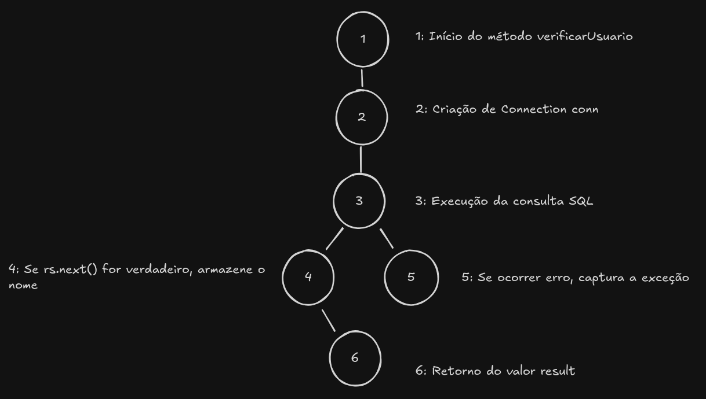

# 📝 **ETAPA 3 - Análise de Caixa Branca**

## 🔍 **Grafo de Fluxo**

### **Explicação dos Pontos:**
- **1:** O método `verificarUsuario` é iniciado, verificando o login e senha do usuário.
- **2:** A conexão com o banco de dados é estabelecida.
- **3:** A consulta SQL é executada para buscar o nome do usuário.
- **4:** A decisão de verificar se o resultado foi encontrado (`rs.next()`).
- **5:** Caso o usuário seja encontrado, o nome é atribuído à variável `nome` e o método retorna `true`.
- **6:** Se ocorrer um erro, a exceção é capturada e armazenada, mas o método segue retornando `false`.

## 📊 **Complexidade Ciclomática**

\[
V(G) = E - N + 2P = 4 - 3 + 2 = 2
\]

Onde:
- \(E\) é o número de arestas (conexões entre as etapas).
- \(N\) é o número de nós (pontos de decisão ou ações).
- \(P\) é o número de componentes conectados (no nosso caso, \(P = 1\)).

## 🚶‍♂️ **Caminhos Identificados**

Existem 5 possíveis caminhos para o fluxo do código:

1. **Caminho 1:** O usuário é autenticado com sucesso. A consulta SQL retorna um usuário válido, o nome é atribuído à variável `nome`, e o método retorna `true`.

2. **Caminho 2:** O login ou senha está incorreto. A consulta SQL não encontra nenhum usuário correspondente, e o método retorna `false`.

3. **Caminho 3:** O banco de dados está fora do ar ou inacessível, o que causa um erro na execução da consulta SQL. A exceção é capturada, mas o método retorna `false`, sem tratamento ou aviso ao usuário.

4. **Caminho 4:** A consulta SQL gera um erro, como um erro de sintaxe ou problema na construção da query. A exceção é capturada e armazenada, mas o método não retorna um erro específico, apenas `false`.

5. **Caminho 5:** A conexão com o banco de dados não foi estabelecida corretamente (provavelmente devido a falha no driver ou na configuração do banco de dados). O método `conectarBD` retorna `null`, mas o código continua a execução com `conn`

---
